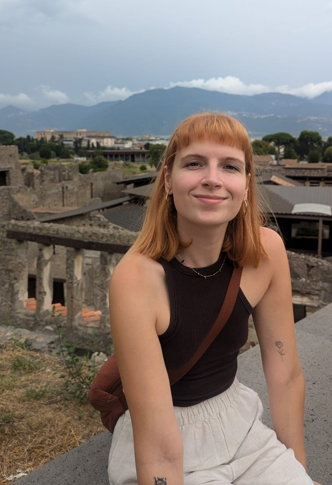

  

  

    <h1>Charlotte McGinty</h1>

    

      <a href="mailto:charlotte.mcginty@nhm.ac.uk" style="display:inline-block; padding: 8px 16px; margin: 6px 6px 0 0; background:#333; color:#fff; border-radius:20px; text-decoration:none; font-size:0.9rem;">✉️ Email</a>
      <a href="https://github.com/charlotte-r-mcginty" style="display:inline-block; padding: 8px 16px; margin: 6px 6px 0 0; background:#333; color:#fff; border-radius:20px; text-decoration:none; font-size:0.9rem;">🐙 GitHub</a>
      <a href="https://uk.linkedin.com/in/charlotte-mcginty-a10236185" style="display:inline-block; padding: 8px 16px; margin: 6px 6px 0 0; background:#333; color:#fff; border-radius:20px; text-decoration:none; font-size:0.9rem;">💼 LinkedIn</a>
    

    
I am a Geospatial Analyst in the <a href="https://biodiversity-futures-lab.github.io/" target="_blank">Biodiversity Futures Lab</a> at the Natural History Museum in London, where I develop and apply geospatial workflows to support the development of the <a href="https://www.nhm.ac.uk/our-science/services/data/biodiversity-intactness-index.html" target="_blank">Biodiversity Intactness Index</a>. 
    
    
My work focuses on analysing large-scale spatial datasets and integrating them into reproducible workflows that generate data products for understanding biodiversity change in a human-dominated world.

    
Before joining the Museum, I worked across a variety of analytical and spatial data roles in the <strong>UK Civil Service</strong> at <strong>Natural England</strong> and the <strong>Department for Environment, Food and Rural Affairs (Defra)</strong>. My experience spans spatial data management, GIS, species licensing, and agricultural statistics.

    
I have a background in biology, geography, and environmental science. I completed a BSc in Biology and Geography at the <strong>University of St Andrews</strong> and an MRes in Ecosystems and Environmental Change at <strong>Imperial College London</strong>. During my studies, I worked on projects exploring bumblebee populations across urban green spaces and investigating the effects of pesticide exposure and climate change on bumblebee foraging behaviour.

